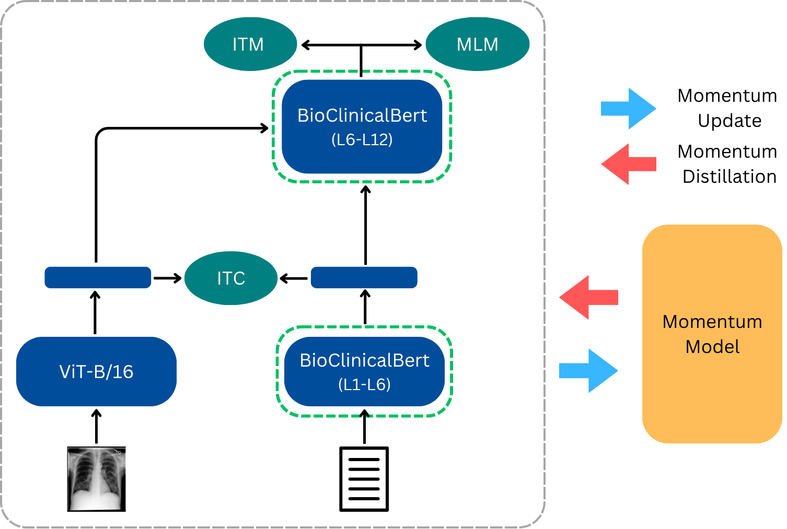

# ADMCXR
 A Domain-Specific Multimodal Framework for Chest X-ray Report Retrieval. 
This is an official repository for ADMCXR, a radiology report retrieval framework that presents a modified version of ALBEF with the integration of BioClinicalBERT as the text and multimodal encoder to enhance image-text alignment for better retrieval.

**Model Architecture**

  

